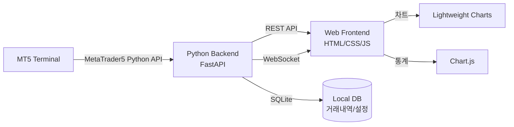
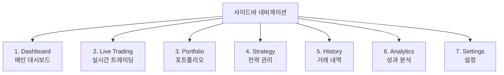

# MT5 시스템 트레이딩 웹 대시보드 구현 계획

> [!NOTE]
> **문서 상태 (2026-07-10 기준): 초기 계획 문서 — 대부분 역사적.**
> 이 문서는 2026-05-26에 작성된 초기 UI 계획(MT5 FX 대시보드, SQLite 백엔드, 7-페이지 프론트엔드)입니다.
> 이후 프로젝트는 **무료 데이터 전용 3-모듈 자동매매 시스템**(펀더멘털+기술적+정보 분석, KR KOSPI200+KOSDAQ150 / US S&P500+NASDAQ100 주식)으로 크게 확장되었고, 저장소는 SQLite가 아닌 **PostgreSQL**을 사용합니다. MT5는 현재 **FX/금 전용**으로만 연동돼 있고(dry_run/live 게이트), 주식은 **PaperBroker(시뮬레이션)**만 배선됨 — KIS(KR)/Alpaca(US) 실거래 어댑터는 미구현이라 실전 전 페이퍼 관측이 필수입니다.
> **현재 상태·설계·일일 로그는 이 문서가 아니라 `WORK_LOG.md`(일자별 권위 기록)와 `GAPS.md`를 참조하세요.** 아래 내용은 삭제하지 않고 초기 계획 기록으로 보존합니다.

## 프로젝트 개요

MetaTrader 5(MT5)와 연동하여 **자동매매(시스템 트레이딩)** 상태를 실시간으로 모니터링하고 제어할 수 있는 **프리미엄 웹 대시보드**를 구축합니다.

### 기술 스택

| 계층 | 기술 | 설명 |
|------|------|------|
| **프론트엔드** | HTML5 + Vanilla CSS + JavaScript | 프레임워크 없이 순수 웹 기술 |
| **백엔드** | Python + FastAPI | MT5 연동 및 REST API 제공 |
| **MT5 연동** | MetaTrader5 Python 패키지 | MT5 터미널 데이터 브릿지 |
| **실시간 통신** | WebSocket | 실시간 시세/포지션 스트리밍 |
| **차트 라이브러리** | Lightweight Charts (TradingView) | 캔들차트 및 기술적 분석 |
| **데이터 차트** | Chart.js | 수익률, 통계 시각화 |

---

## 시스템 아키텍처



---

## User Review Required

> [!IMPORTANT]
> **MT5 터미널 필수**: 이 시스템은 로컬 PC에 MT5 터미널이 설치되어 있어야 합니다. Python `MetaTrader5` 패키지가 MT5 터미널과 통신합니다.

> [!WARNING]  
> **실거래 주의**: 자동매매 기능은 실제 자금이 관련될 수 있습니다. 초기 개발은 **데모 계좌**로 진행하는 것을 강력 권장합니다.

---

## Open Questions

> [!IMPORTANT]
> 1. **거래 대상**: 주로 거래할 상품은 무엇인가요? (예: EURUSD, XAUUSD, 나스닥 선물 등)
> 2. **자동매매 전략**: 이미 사용 중인 EA(Expert Advisor)나 전략이 있나요? 아니면 웹에서 전략을 설정할 수 있는 기능이 필요한가요?
> 3. **다중 계좌**: 여러 MT5 계좌를 동시에 관리해야 하나요?
> 4. **알림 기능**: 텔레그램, 이메일 등 외부 알림이 필요한가요?
> 5. **모바일 대응**: 모바일에서도 사용해야 하나요, 아니면 데스크탑 전용인가요?

---

## 페이지 구성 (총 7개 페이지)

### 페이지 구조 요약



---

### 1. 📊 Dashboard (메인 대시보드)

사용자가 로그인 후 가장 먼저 보는 화면. **5초 이내**에 계좌 상태를 파악할 수 있도록 설계.

| 위젯 | 설명 |
|------|------|
| **계좌 요약 카드** | 잔고, 자산, 마진, 여유증거금, 일일 P&L |
| **실시간 P&L 게이지** | 오늘의 수익/손실을 시각적 게이지로 표시 |
| **활성 포지션 요약** | 현재 열린 포지션 수, 총 수익/손실 |
| **시장 개요** | 주요 종목 실시간 시세 미니 차트 |
| **최근 거래** | 최근 5건 거래 타임라인 |
| **전략 상태** | 실행 중인 전략 상태 표시등 |
| **시스템 상태** | MT5 연결 상태, 서버 지연시간, 마지막 업데이트 시간 |

**레이아웃**: Bento Grid (4열 반응형)

---

### 2. 📈 Live Trading (실시간 트레이딩)

실시간 차트와 주문 패널을 통한 매매 실행 화면.

| 영역 | 설명 |
|------|------|
| **TradingView 캔들차트** | Lightweight Charts 기반, 다중 타임프레임 |
| **호가창 (Order Book)** | 매수/매도 호가 실시간 표시 |
| **주문 패널** | 시장가/지정가/손절/익절 주문 입력 |
| **활성 포지션 테이블** | 실시간 P&L 업데이트, 원클릭 청산 |
| **대기 주문** | 미체결 주문 목록 및 수정/취소 |
| **종목 리스트** | 관심종목 워치리스트 |

**레이아웃**: 3단 분할 (차트 60% / 호가+주문 20% / 포지션 20%)

---

### 3. 💼 Portfolio (포트폴리오)

자산 구성과 리스크를 한눈에 파악.

| 위젯 | 설명 |
|------|------|
| **자산 배분 도넛 차트** | 종목별 비중 시각화 |
| **포지션 상세 카드** | 각 포지션의 진입가, 현재가, P&L, 보유기간 |
| **리스크 매트릭스** | 각 포지션의 리스크 수준 히트맵 |
| **상관관계 차트** | 보유 종목 간 상관관계 |
| **마진 사용률** | 프로그레스 바로 마진 사용률 표시 |

---

### 4. 🤖 Strategy (전략 관리)

자동매매 전략의 설정, 모니터링, 백테스트 결과 관리.

| 영역 | 설명 |
|------|------|
| **전략 카드 그리드** | 각 전략의 상태(실행/중지/오류), 수익률 |
| **전략 설정 패널** | 파라미터 조정, 종목/타임프레임 선택 |
| **백테스트 결과** | 수익 곡선, 최대 낙폭, 승률 통계 |
| **전략 로그** | 실시간 전략 실행 로그 스트림 |
| **원클릭 제어** | 전략 시작/중지/일시정지 토글 |

---

### 5. 📋 History (거래 내역)

과거 거래 기록의 상세 조회 및 필터링.

| 기능 | 설명 |
|------|------|
| **거래 테이블** | 정렬/필터 가능한 대용량 테이블 |
| **날짜 범위 필터** | 커스텀 기간 선택 |
| **종목/전략 필터** | 드롭다운 다중 필터 |
| **거래 상세 모달** | 클릭 시 개별 거래 상세 팝업 |
| **내보내기** | CSV/Excel 다운로드 |

---

### 6. 📉 Analytics (성과 분석)

트레이딩 성과를 다양한 각도에서 분석.

| 차트/지표 | 설명 |
|------|------|
| **에쿼티 커브** | 시간에 따른 자산 변화 라인 차트 |
| **일일/주간/월간 수익** | 바 차트로 기간별 수익 비교 |
| **승률/손익비** | KPI 카드 + 진행률 바 |
| **최대 낙폭 (Max Drawdown)** | 영역 차트로 낙폭 시각화 |
| **종목별 성과** | 히트맵으로 종목별 수익/손실 |
| **시간대별 수익** | 시간대별 거래 성과 분석 |
| **월간 캘린더 히트맵** | 일별 수익을 색상으로 표시 |

---

### 7. ⚙️ Settings (설정)

| 영역 | 설명 |
|------|------|
| **MT5 연결 설정** | 서버, 로그인 정보, 연결 테스트 |
| **위험 관리** | 최대 포지션 수, 일일 손실 한도, 최대 레버리지 |
| **알림 설정** | 알림 조건 및 채널 설정 |
| **테마 설정** | 다크/라이트 모드 토글 |
| **API 키 관리** | 외부 연동용 API 키 |

---

## 디자인 시스템

### 컬러 팔레트

```
다크 모드 (기본):
├── Background:     #0a0e17 (깊은 네이비)
├── Surface:        #111827 (카드 배경)
├── Surface Hover:  #1a2332 (호버 상태)
├── Border:         #1e293b (테두리)
├── Text Primary:   #e2e8f0 (주요 텍스트)
├── Text Secondary: #94a3b8 (보조 텍스트)
├── Accent Blue:    #3b82f6 (주요 액센트)
├── Accent Purple:  #8b5cf6 (보조 액센트)
├── Profit Green:   #10b981 (수익)
├── Loss Red:       #ef4444 (손실)
├── Warning Amber:  #f59e0b (경고)
└── Gradient:       linear-gradient(135deg, #3b82f6, #8b5cf6)
```

### 타이포그래피
- **제목**: Inter (Google Fonts), Bold
- **본문**: Inter, Regular
- **숫자/금액**: JetBrains Mono (고정폭, 가독성)

### UI 요소
- **카드**: `border-radius: 16px`, 미세한 글래스모피즘, 미묘한 border glow
- **버튼**: `border-radius: 12px`, gradient 배경, hover 시 scale 및 glow 효과
- **테이블**: 교대 행 색상, hover highlight, 스티키 헤더
- **애니메이션**: `transition: all 0.3s cubic-bezier(0.4, 0, 0.2, 1)`
- **차트**: 다크 테마 통일, 그리드 라인 최소화

---

## 프로젝트 파일 구조

```
superrich/
├── index.html                    # 메인 SPA 엔트리
├── css/
│   ├── variables.css             # CSS 변수 (컬러, 간격, 타이포)
│   ├── base.css                  # 리셋 & 기본 스타일
│   ├── layout.css                # 그리드, 사이드바, 레이아웃
│   ├── components.css            # 버튼, 카드, 테이블, 모달 등
│   └── pages/
│       ├── dashboard.css
│       ├── trading.css
│       ├── portfolio.css
│       ├── strategy.css
│       ├── history.css
│       ├── analytics.css
│       └── settings.css
├── js/
│   ├── app.js                    # 앱 초기화 & 라우팅
│   ├── router.js                 # SPA 라우터
│   ├── api.js                    # REST API 클라이언트
│   ├── websocket.js              # WebSocket 클라이언트
│   ├── utils.js                  # 유틸리티 함수
│   ├── components/
│   │   ├── sidebar.js            # 사이드바 네비게이션
│   │   ├── header.js             # 헤더 바
│   │   ├── card.js               # 재사용 카드 컴포넌트
│   │   ├── table.js              # 데이터 테이블 컴포넌트
│   │   ├── chart.js              # 차트 래퍼
│   │   ├── modal.js              # 모달 컴포넌트
│   │   └── toast.js              # 토스트 알림
│   └── pages/
│       ├── dashboard.js
│       ├── trading.js
│       ├── portfolio.js
│       ├── strategy.js
│       ├── history.js
│       ├── analytics.js
│       └── settings.js
├── assets/
│   ├── icons/                    # SVG 아이콘
│   └── images/                   # 이미지 리소스
├── backend/
│   ├── main.py                   # FastAPI 서버
│   ├── mt5_bridge.py             # MT5 연동 모듈
│   ├── models.py                 # 데이터 모델
│   ├── routes/
│   │   ├── account.py            # 계좌 API
│   │   ├── trading.py            # 매매 API
│   │   ├── history.py            # 거래내역 API
│   │   └── strategy.py           # 전략 API
│   ├── websocket_manager.py      # WebSocket 관리
│   ├── database.py               # SQLite 연결
│   └── requirements.txt          # Python 의존성
└── README.md
```

---

## 구현 순서

### Phase 1: 기반 구축 (디자인 시스템 + 레이아웃)
1. CSS 디자인 시스템 구축 (`variables.css`, `base.css`, `components.css`)
2. SPA 라우터 및 사이드바 네비게이션 구현
3. 기본 레이아웃 프레임 완성

### Phase 2: 메인 대시보드
4. Dashboard 페이지 UI 구현 (더미 데이터)
5. 위젯 카드, 미니 차트, 상태 표시 구현

### Phase 3: 트레이딩 & 포트폴리오
6. Live Trading 페이지 (캔들차트 + 주문 패널)
7. Portfolio 페이지 (자산 배분 시각화)

### Phase 4: 전략 & 분석
8. Strategy 관리 페이지
9. Analytics 성과 분석 페이지

### Phase 5: 기록 & 설정
10. History 거래내역 페이지
11. Settings 설정 페이지

### Phase 6: 백엔드 연동
12. FastAPI 서버 구축
13. MT5 Python API 연동
14. WebSocket 실시간 데이터 스트리밍
15. REST API 엔드포인트 구현

---

## Verification Plan

### 자동 테스트
- 브라우저에서 각 페이지 로딩 확인
- SPA 라우팅 동작 확인
- 반응형 레이아웃 검증 (다양한 화면 크기)
- WebSocket 연결 안정성 테스트

### 수동 검증
- 다크 모드 디자인 품질 확인 (스크린샷 캡처)
- 차트 인터랙션 (줌, 패닝, 호버 툴팁)
- 모든 페이지 간 네비게이션 흐름
- MT5 연결 상태 확인 (MT5 터미널 실행 시)
